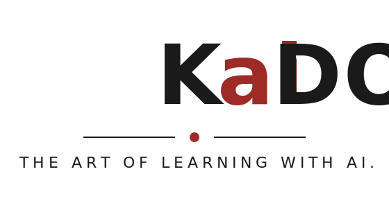

{ .kaido-hero }

A curated, open knowledge base on learning science and the responsible use of AI for learning.

## What this is

Kaido collects evidence-based learning-science concepts and vetted sources. The goal is to help anyone who designs learning experiences or AI-assisted learning tools, and to reason clearly about when AI helps learning versus when it short-circuits it.

It is deliberately generic and reusable: theory and sources, not product documentation.

## Contents

- [Learning Science Concepts](learning_science_concepts.md) , 15 learning-science concepts (cognitive load, ICAP, self-regulation, formative assessment, and more), mapped to a student/lecturer Domain Map (S1:S7 / T1:T7), with relevance notes for AI learning assistants.
- [AI in Education , Articles](ai_in_education_articles.md) , curated bibliography of AI-in-education articles and reports, each with a reliability rating.

## Conventions

- Plain Markdown.
- **Source reliability key:** 🟢 primary research / authoritative, 🟠 serious journalism / institutional, 🔴 blog / vendor / low-quality journal (cite with caution or avoid).
- No em dash or en dash anywhere: use ":" or "," instead.

## How to use and contribute

- When making a claim, pull from authoritative sources (🟢) first; treat 🔴 items as examples of what not to cite.
- Add new material under the right reliability tier, with a date and a one-line "why it matters".
- Pair claims about AI and learning with the underlying mechanism (cognitive load, retrieval, metacognition) rather than opinion alone.
